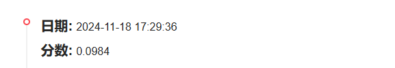

# [新闻推荐](https://tianchi.aliyun.com/competition/entrance/531842/introduction)

## 1 比赛介绍

赛题以新闻APP中的新闻推荐为背景，要求选手根据用户历史浏览点击新闻文章的数据信息预测用户未来点击行为，即用户的最后一次点击的新闻文章。

测试集对最后一次点击行为进行了剔除。通过这道赛题来引导大家了解推荐系统中的一些业务背景，解决实际问题，帮助竞赛新人进行自我练习、自我提高。

---

## 2 数据集概述

赛题以预测用户未来点击新闻文章为任务，该数据来自某新闻APP平台的用户交互数据，包括30万用户，近300万次点击，共36万多篇不同的新闻文章，同时每篇新闻文章有对应的 embedding 向量表示。

为了保证比赛的公平性，将会从中抽取20万用户的点击日志数据作为训练集，5万用户的点击日志数据作为测试集A，5万用户的点击日志数据作为测试集B。

### 2.1 文件描述

| 文件名称                  | 描述                  |
|-----------------------|---------------------|
| `train_click_log.csv` | 训练集用户点击日志           |
| `testA_click_log.csv` | 测试集用户点击日志           |
| `articles.csv`        | 新闻文章信息数据表           |
| `articles_emb.csv`    | 新闻文章 embedding 向量表示 |
| `sample_submit.csv`   | 提交样例文件              |

### 2.2 字段描述

| 序号 | 特征名称                    | 描述                        |
|----|-------------------------|---------------------------|
| 1  | user_id                 | 用户id                      |
| 2  | click_article_id        | 点击文章id                    |
| 3  | click_environment       | 点击环境                      |
| 4  | click_deviceGroup       | 点击设备组                     |
| 5  | click_os                | 点击操作系统                    |
| 6  | click_timestamp         | 点击时间戳                     |
| 7  | click_country           | 点击城市                      |
| 8  | click_region            | 点击地区                      |
| 9  | click_referrer_type     | 点击来源类型                    |
| 10 | article_id              | 文章id，与click_article_id相对应 |
| 11 | category_id             | 文章类型id                    |
| 12 | created_at_ts           | 文章创建时间戳                   |
| 13 | words_count             | 文章字数                      |
| 14 | emb_1,emb_2,...,emb_249 | 文章embedding向量表示           |

---

## 3 提交内容

最后提交的格式是针对每个用户， 我们都会给出五篇文章的推荐结果，按照点击概率从前往后排序。
而真实的每个用户最后一次点击的文章只会有一篇的真实答案，所以我们就看我们推荐的这五篇里面是否有命中真实答案的。

比如对于 `user1` 来说， 我们的提交会是：

```csv
user1, article1, article2, article3, article4, article5
```

---

## 4 算法设计

参考[分享](https://tianchi.aliyun.com/forum/post/170754)

---

## 5 记录

1. 11-18: 提交 baseline，分数为 0.0984

